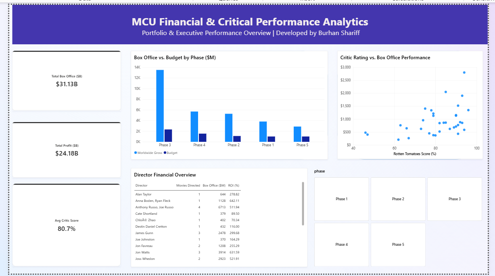

# MCU_Financial_Analytics_PowerBI
Executive Power BI dashboard analyzing MCU box office performance, budgets, ROI, and critic scores using custom SQL views.


# MCU Financial & Critical Performance Analytics



## Overview
An executive-level Power BI dashboard analyzing box office performance, production budgets, director ROI, and critical reception across all Marvel Cinematic Universe (MCU) phases. Built on top of structured SQL Server views to replicate an enterprise reporting environment.

## Key Visual Features
* **Executive KPI Cards**: Tracks total worldwide gross ($31.13B), total net profit ($24.18B), and average critic score (80.7%) using dynamic DAX measures.
* **Phase Performance Breakdown**: Clustered column chart comparing worldwide gross against production budget by phase ($M).
* **Critic Rating vs. Box Office**: Scatter plot correlating Rotten Tomatoes scores (%) with global financial returns ($M).
* **Director Performance Overview**: Matrix evaluating movies directed, total box office gross, and ROI percentage per director.
* **Interactive Slicers**: Custom phase filter allowing dynamic slicing across all canvas visuals.

## Data Pipeline & Architecture
* **Database Layer**: SQL Server views (`vw_financial_vs_critics`, `vw_phase_financials`, `vw_director_performance`)
* **Analytics & Data Modeling**: Power BI Desktop, custom DAX measures for dynamic currency scaling ($B) and percentage formatting
* **UI/UX Design**: Modular grid layout, standardized visual buckets, executive typography styling

## DAX Measures Used

```dax
Total Box Office ($B) = 
FORMAT(
    DIVIDE(SUM(vw_financial_vs_critics[worldwide_box_office_millions]), 1000), 
    "$#,##0.00"
) & "B"

Total Profit ($B) = 
FORMAT(
    DIVIDE(SUM(vw_financial_vs_critics[profit_millions]), 1000), 
    "$#,##0.00"
) & "B"

Avg Critic Score = 
FORMAT(
    AVERAGE(vw_financial_vs_critics[rotten_tomatoes]), 
    "0.0"
) & "%"
